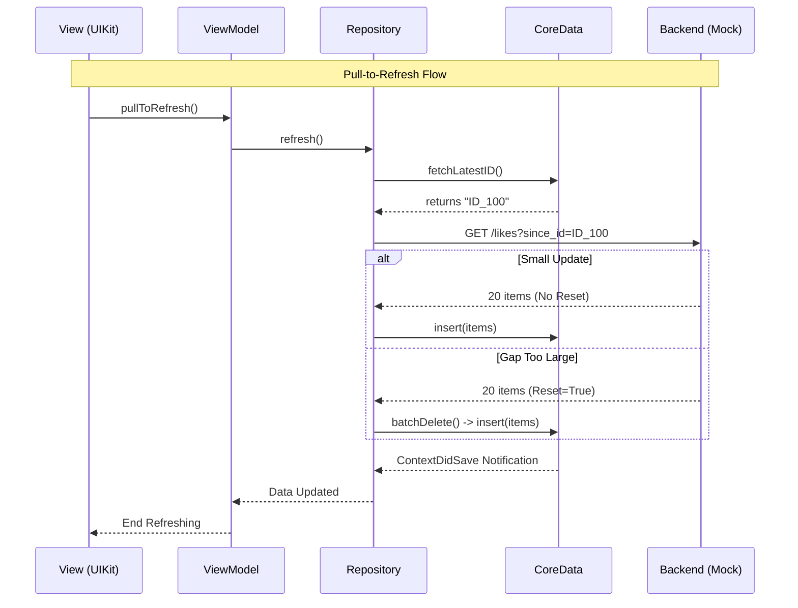

# Architecture Document - Notification Center Module

## 1. High-Level Overview

This module is designed as a standalone **Mini-App** responsible for managing incoming likes, matches, and the "Unblur" monetization feature.

* **Pattern:** **MVVM-C (Model-View-ViewModel + Coordinator)**
* **Coordinator:** Manages navigation flow and module entry points.
* **ViewModel:** Handles presentation logic, timer states, and user intent.
* **View (UIKit):** Programmatic UI with AutoLayout. Binds to VM state via Combine.
* **Repository:** The Single Source of Truth (SSOT). Orchestrates data fetching and persistence.


* **Tech Stack:** Swift 5+, UIKit, Combine, CoreData, Async/Await.

---

## 2. Data Flow & Synchronization

We strictly follow a **Unidirectional Data Flow**. The View never requests data from the Network directly; it observes the database.

### The "Source of Truth" Pipeline

1. **Read Path:** `CoreData`  `NSFetchedResultsController`  `ViewModel`  `View`.
2. **Write Path:** `View`  `ViewModel`  `Repository`  `API` (concurrently updates `CoreData` for Optimistic UI).

### Real-Time Updates (Pull-to-Refresh Strategy)

To ensure UI stability and performance, we avoid pushing new items directly into the view while the user is reading.

1. **Detection:** The app monitors a "New Likes" signal (simulated via Mock Service).
2. **Notification:** When updates are available, a **"New Likes Available"** indicator appears.
3. **Ingestion:** User triggers **Pull-to-Refresh**.
4. **Gap Handling (Soft Reset):**
* The client requests items `since_id={latest_local_id}`.
* **Scenario A (Normal):** Server returns small batch (< 50 items). App merges them into CoreData.
* **Scenario B (Gap Too Large):** Server returns `reset_required: true`. App **wipes the local cache** and replaces it with the latest batch to ensure data consistency.




---

## 3. Persistence Layer (CoreData)

CoreData is chosen for its efficient memory management (faulting) and automatic UI synchronization via `NSFetchedResultsController`.

### Schema: `UserProfile`

* **`id` (String):** Primary Key.
* **`name` (String):** Display name.
* **`photoURL` (String):** Remote asset URL.
* **`status` (Int16):** Enum mapping (`0: incoming`, `1: mutual`, `2: passed`).
* **`createdAt` (Date):** Sort key for the feed.
* **`serverIsBlurred` (Bool):** The intrinsic visibility state from the backend.

### Invalidation Rules & Cache Policy

* **On App Launch:** **Keep Data.** Load immediately from CoreData to show the last known state (Offline Support).
* **On Refresh:** **Merge or Reset** based on the "Gap" size (see Section 2).
* **On Action (Like/Skip):** **Immediate Update.** Change `status` property in CoreData.
* *Effect:* Item automatically moves tabs or disappears via Predicate filtering.
* *Revert:* If API fails, roll back the transaction.


---

## 4. API Contract & Pagination

We use **Cursor-Based Pagination** to prevent duplicate items during real-time insertions.

### GET `/configuration/features`

Fetches global feature flags. Called on module startup.
**Response:**

```json
{
  "is_blur_enabled": true,  // Default server-side setting
  "refresh_interval_sec": 30
}

```

### GET `/likes`

Fetches a list of profiles.

| Parameter | Type | Description |
| --- | --- | --- |
| `limit` | `Int` | Batch size (default: 20). |
| `cursor` | `String?` | For **Infinite Scroll** (Load More). Token from previous page. |
| `since_id` | `String?` | For **Pull-to-Refresh**. Fetches items newer than this ID. |

**Response:**

```json
{
  "data": [ ... ],
  "meta": {
    "next_cursor": "eyJid... (opaque string)",
    "reset_required": false 
  }
}

```

### POST `/likes/{user_id}/action`

Performs a Like or Skip.

* **Body:** `{ "action": "like" | "pass" }`
* **Response:** `200 OK` (Empty body).

### POST `/unblur/start`

Activates the unblur timer.

* **Response:**

```json
{
  "expires_at": "2025-01-20T14:30:00Z", // Server-authoritative end time
  "is_active": true
}

```

### GET `/unblur/state`

Checks the current timer status (Crucial for Cross-Device sync).

* **Response:**

```json
{
  "expires_at": "2025-01-20T14:30:00Z", // Null if expired
  "is_active": true
}

```

---

## 5. "Unblur" Strategy (Timer Resilience)

The "Blur" state is managed globally via **Composition**, not stored per-user in the database.

### Logic

1. **State Source:**
* **Feature Flag (`is_blur_enabled`):** Fetched from `/configuration/features`. Determines the default blurred state.
* **Timer (`expires_at`):** Fetched from `/unblur/state` on launch and `/unblur/start` on activation.


2. **Server-Authoritative Timer:**
* Client saves the `expires_at` timestamp to `UserDefaults` (Global Config).
* **Cross-Device Sync:** On app foregrounding, the client calls `GET /unblur/state`. If the server returns a future date (started on another device), the local timer starts immediately.


3. **UI Resolution:**
* The View checks: `isContentVisible = isUnblurTimerActive || !isFeatureFlagEnabled`.
* This ensures instant UI updates without performing 5,000 database writes to toggle a boolean.

